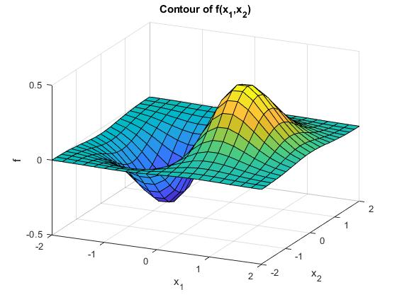
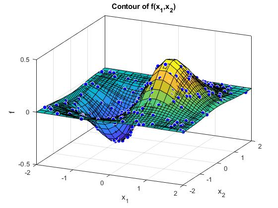

# Deep neural network
Example of the universal approximation theory of DNN

The universal approximation theorem states that a feed-forward deep network (with one or
more hidden layers) containing a finite number of neurons can approximate any continuous
functions compact subsets of Rn. 

We will see an example of this property for a specific function, in this exercise we will train the
network in order to approximate the following function: f(x1,x2)=x1exp(-x12-x22)  

  

We consider the following network architecture:
* Two inputs
* Five neurons in the first hidden layer
* Four neurons in the second hidden layer
* One linear output

  
